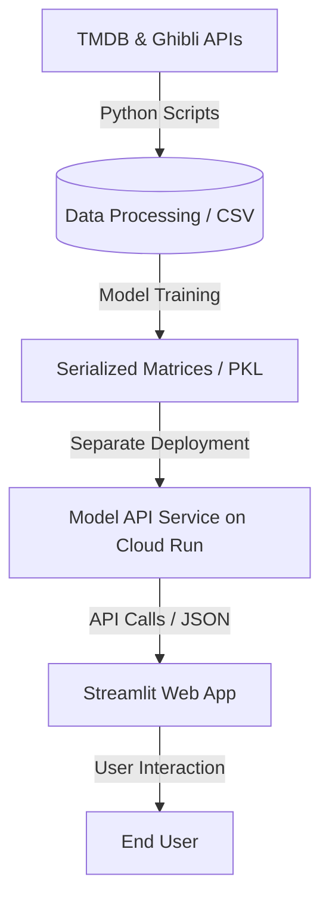

# Ghibli Data Science and Recommendation Pipeline 

---

## Assignment Overview and Goals

This project builds an end-to-end data pipeline to collect, clean, merge, and analyze movie data from four sources,
and produces a machine-learning-powered recommendation application for Studio Ghibli Films:

- The Movie Database (TMDB) API
- Studio Ghibli API
- Manual Interest Labels
- Ghibli Landscape Images

The goal is to:
- Build a reproducible data pipeline with visual outputs
- Create a content-based recommendation model using Jaccard Similarity
- Deploy an interactive Streamlit application for users to explore the films visually and get recommendations

## Solution Architecture Diagram



## Deployment Links
- **Interactive Streamlit Web Application:** [Live App Link](your_deployed_app_url)
- **Model Inference API Endpoint:** [Live API Link](your_deployed_api_url)

---

## Setup Instructions

### 1. Clone project
```bash
git clone <repo_url>
cd project
```

### 2. Create virtual environment
```bash
python -m venv venv
```

Activate:

Windows:
```bash
venv\Scripts\activate
```

Mac/Linux:
```bash
source venv/bin/activate
```

### 3. Install dependencies
```bash
pip install -r requirements.txt
```
---

## API Keys

### Set your API key:

**Mac/Linux**
```bash
export TMDB_API_KEY="your_key_here"
```

**Windows**
```bash
set TMDB_API_KEY=your_key_here
```
---

## How to Run the Pipeline

### Step 1: Collect data (TMDB + GHIBLI APIs)
```bash
python ghibli_api_collector.py
python build_ghibli_entities.py
python tmdb_api_collector.py
```
This generates:

data/processed/ghibli_entities.csv  

---

### Step 2: Extract, clean, and merge data
```bash
python data_processors/merge_tmdb_ghibli.py
python data_processors/ghibli_image_matcher.py
python data_processors/ghibli_label_tagging.py
```
This sanitizes movie titles (lowercase, normalization), fixes rating data types, appends official landscape image links and manual interest tags, and saves the cleaned dataset to data/processed/.
The final processed dataset is final_dataset.csv, and has data from all four sources.

---

### Step 3: Run analysis on final dataset
```bash
python analysis/analyze_data.py
```
Outputs:
- Visualization plots saved directly into analysis_tmdb_ghibli/
- Findings are written in REPORT.md from the generate_report.py script
---

### Step 4: Train, evaluate, and serialize the model
```bash
python model.py
```
This script acts as the machine learning engine:
- Compiles and formats feature vectors into a consolidated token mapping array.
- Validates the system architecture by executing an automated user-profile simulator.
- Quantifies accuracy via Information Retrieval metrics (Hit Rate @ 5 and Mean Reciprocal Rank).
- Runs a Monte Carlo simulation over 1,000 random user queries to test system matrix sparsity.
- Saves the resulting dual-panel diagnostic visualization to jaccard_score_distribution.png and saves the serialized matrices into models/.

---

### Step 5: Launch the web application
```bash
streamlit run app.py
```

---

### Step 6: Containerization

How to run this on Podman:
```bash
# Build the containers
docker build -t ghibli-app ./app
docker build -t ghibli-api ./api

# Run the services
docker run -p 8501:8501 ghibli-app
docker run -p 8080:8080 ghibli-api
```

---

## Dependencies

### Python
- streamlit
- pandas
- numpy
- matplotlib
- seaborn
- requests
- python-dotenv
- scikit-learn
- wordcloud
- joblib
- ntlk
---

## Data Sources

### TMDB API
Provides:
- Movie ratings
- Budget and revenue
- Genres
- Cast and crew
- Release dates

---

### Ghibli API

Provides:
- Director
- Producer
- Description
- People
- Locations
- Species
- Vehicles

---

### Manual & Official Assets
Provides:
- Thematic Interest Labels (manually tagged for the recommendation engine)
- Landscape Images (sourced from Studio Ghibli's official website), saved in data/movie_images 

---

## Ethical Considerations

- TMDB API used under official terms
- Studio Ghibli official landscape images are used in compliance with public availability
- Grave of the Fireflies landscape images are omitted out of respect for Studio Ghibli's explicit decision not to disclose or distribute free promotional screenshot assets for that specific film.
- Data used only for academic purposes
- No personal user data collected 

---

## Known Limitations

- This dataset does not include the most recent Ghibli Film - The Boy and the Heron (2024), and does not include other well-known films made before Studio Ghibli but directed by Hayao Miyazaki (such as Nausicaa)
- Budget and revenue figures for older films or minor co-productions can be incomplete or recorded as 0 in TMDB.
- People, Locations, Vehicles all had many null values from the Ghibli API.
- Recommendation accuracy is tied strictly to the breadth of the manual interest tags and available API metadata.
- Landscape exploration features do not include Grave of the Fireflies, as the Studio Ghibli official website did not upload pictures available for this film.

---

## Future Improvements

- Incorporate deeper NLP processing on film descriptions instead of exact match keyword vectors.
- Implement collaborative filtering if user rating datasets become available.

---

## Outputs

### Processed Data 
- data/processed/
  - ghibli_entities.csv (full ghibli csv)
  - ghibli_tmdb_merged.csv, ghibli_tmdb_merged.json (basic merged dataset without labels and images)
  - final_dataset.csv (merged dataset and the labels and images - used for app and modeling)

### Models
- data/models
  - film_model.pkl
  
### Visualizations

- jaccard_score_distribution.png (Dual-panel distribution modeling global matrix sparsity vs. active top-K return scores for the prediction model)

- analysis_tmdb_ghibli/
  - wordcloud.png 
  - rating_distributions.png 
  - top_genres.png 
  - genre_ratings.png 
  - budget_by_movie.png 
  - revenue_by_movie.png 
  - timeline.png 
  - top_labels.png 
  - label_ratings.png 
  - species_distribution.png 
  - genre_label_species_correlation.png

### AI Assistant Documentation

For my project, I used ChatGPT and Google Gemini chatbots to share my code and receive feedback.
Helpful prompts included describing what I wanted from the model and app, and give a lot of information, such as:

"I want to find common traits of Ghibli movies.
I want labels that matches movies to interests - like:
Racoons: Pom Poko
Cats: My Neighbor Totoro, The Cat Returns, Whisper of the Heart
Witch: Kiki’s Delivery Service, Howl’s Moving Castle, Earwig and the Witch, Spirited Away..."

AI helped me with the architecture of my model and app, while I had to manually edit the code so that 
it handles messy data issues such as lowercase or uppercase titles, title aliases, and null values.

I learned that Google Gemini is very useful in looking at tabs and pdf and pictures of my project, 
and providing code to make my final app UI visually pleasing. I learned about adding emojis and color to my streamlit app
that I wouldn't have known without these tools. However, I definitely couldn't blindly use all the code they provided,
and had to make sure that their solutions matched my real data, and debug any issues that arose.


