# Studio Ghibli Data Analysis & Recommendation Report

Generated: 2026-05-30 14:29:12

---

## Overview

This project builds an end-to-end data pipeline to collect, clean, merge, and analyze movie data from four sources,
and produces a machine-learning-powered recommendation application for Studio Ghibli Films:

- The Movie Database (TMDB) API
- Studio Ghibli API
- Manual Interest Labels
- Ghibli Landscape Images

The goal is to:
- Build a reproducible data pipeline with visual outputs
- Create a content-based recommendation model using Jaccard Similarity
- Deploy an interactive Streamlit application for users to explore the films visually and get recommendations

---

## Exploratory Data Analysis

### Word Cloud
Main themes: human/family, nature, find.

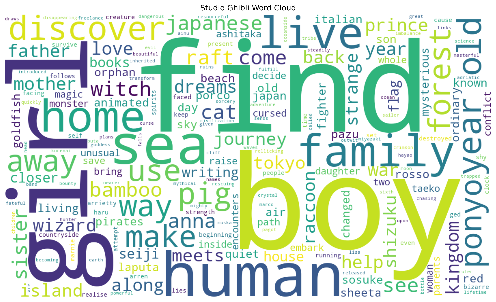

### Ratings Distribution
Showing right-skewed satisfaction; median 7.79, mean 7.64.

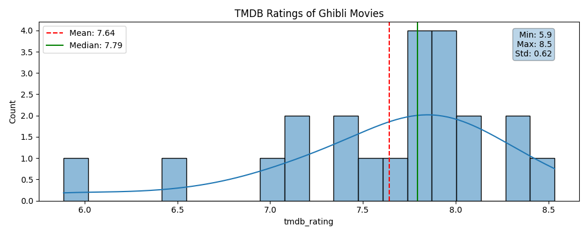

### Genres
Most common genres: Animation, Fantasy, Family.

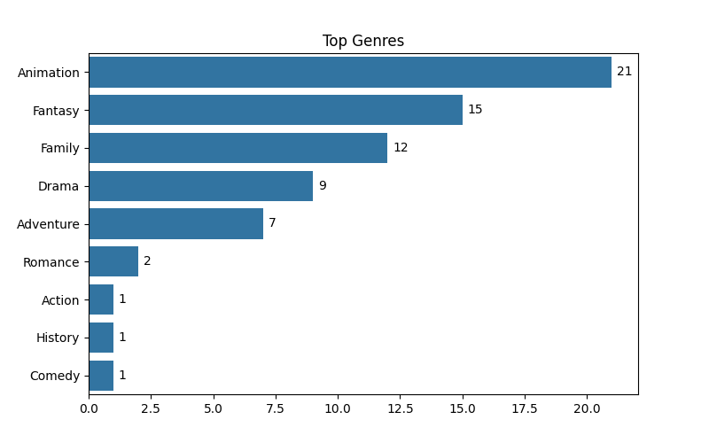

### Genre Ratings
Average ratings were similar across genres, but Action and History had the highest.

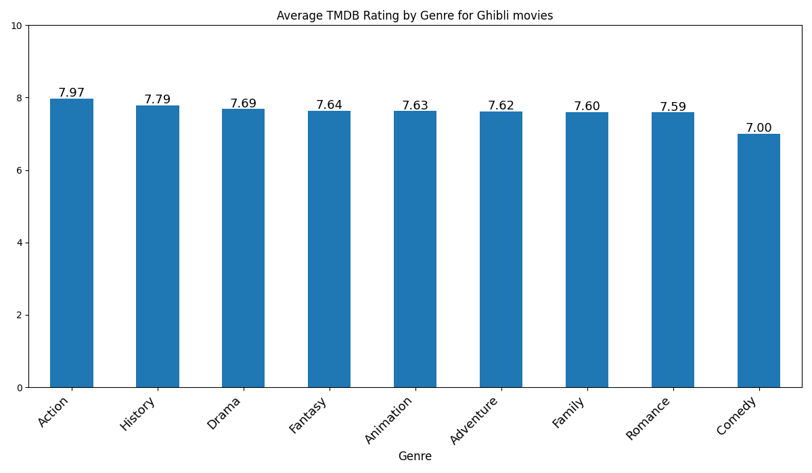

### Labels
Most common labels: family and friendship.

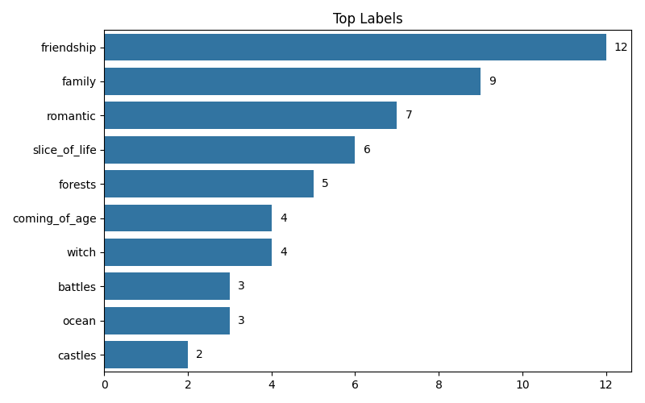

### Label Ratings
Average ratings were similar across labels, but dragons and strong lead had the highest.

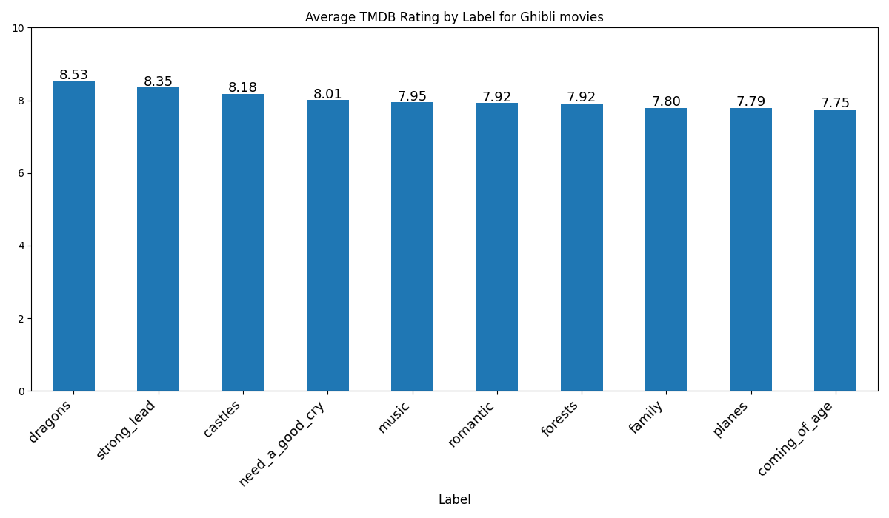

### Revenue
Spirited Away as the peak revenue generator with a remarkably efficient budget, Howl's Moving Castle coming in second.

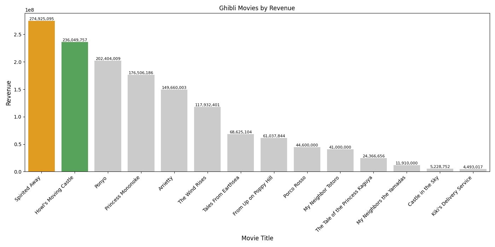

### Budget
Tale of the Princess Kaguya had the highest budget, but Howl's Moving Castle and Spirited Away did not - even with the top two highest revenues.

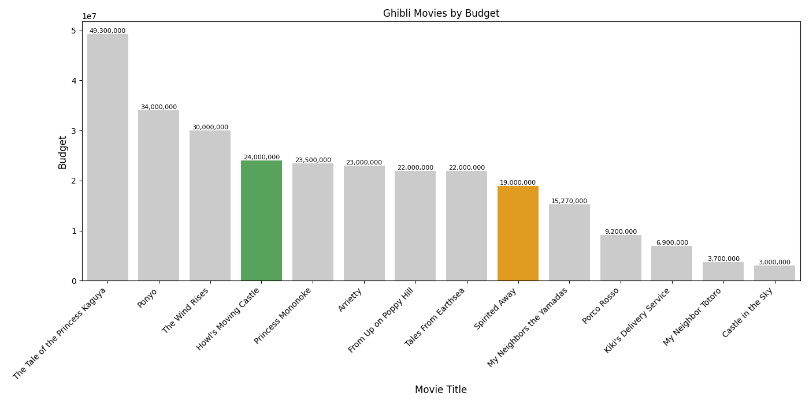

### Timeline
The earliest film was Castle in the Sky and the latest in this dataset was Earwig and the Witch.

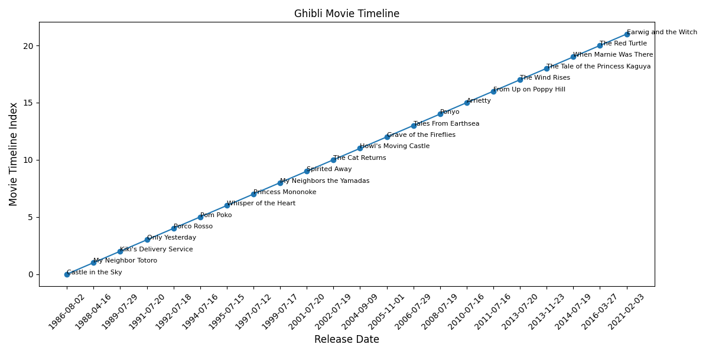

### Species
Most common species were humans, then cats, and there were 7 species in total.

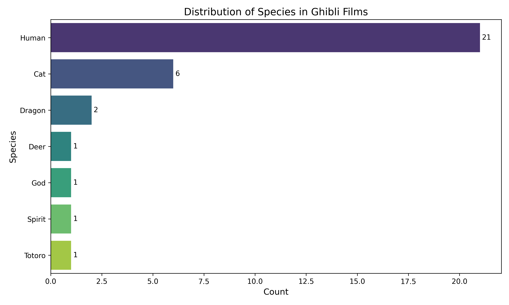

### Correlation Heatmap
Shows a comprehensive correlation analysis on all three features of the model, and the highest correlations were between the History genre and Romance genre, castle label and Action genre, and dragon species and Action genre.
  
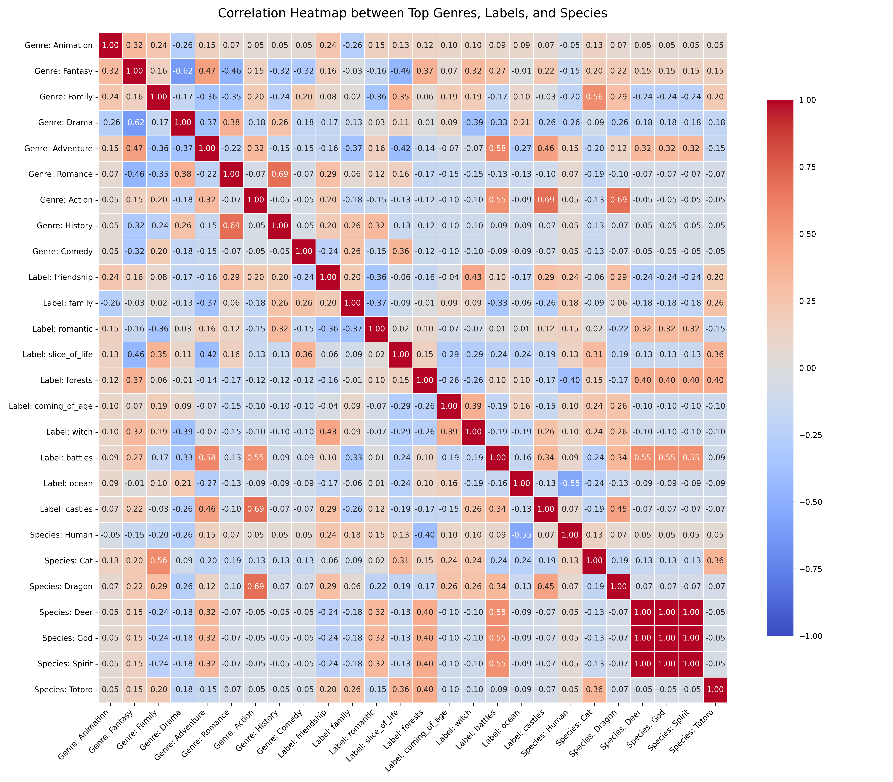

---

## Recommendation System

I built a content-based recommender using:

- genres
- labels
- species

Similarity metric:
Jaccard similarity:
A ∩ B / A ∪ B

Dual-panel distribution modeling global matrix sparsity vs. active top-K return scores for the prediction model:

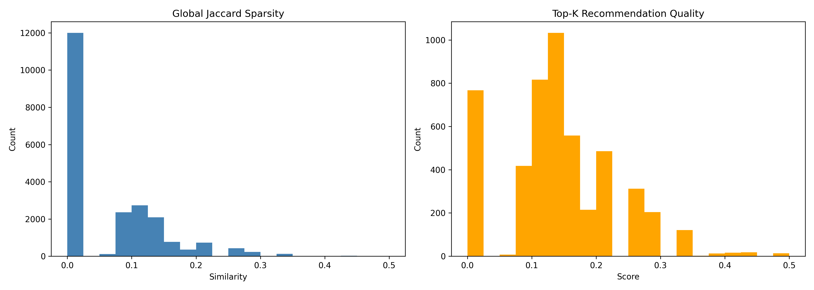
---

## Model Highlights

- Fully interpretable feature-based model
- Sparse but meaningful feature space
- Handles cold-start well (no user history needed)

---

## Deployment

FastAPI endpoint:
`/recommend?features=family&features=magic`

Returns ranked film recommendations.

---

## Conclusion

This project demonstrates an end-to-end ML pipeline:
raw APIs → cleaning → feature engineering → EDA → recommender → deployment.

---

## AI Assistant Documentation

For my project, I used ChatGPT and Google Gemini chatbots to share my code and receive feedback.
Helpful prompts included describing what I wanted from the model and app, and give a lot of information, such as:

"I want to find common traits of Ghibli movies.
I want labels that matches movies to interests - like:
Racoons: Pom Poko
Cats: My Neighbor Totoro, The Cat Returns, Whisper of the Heart
Witch: Kiki’s Delivery Service, Howl’s Moving Castle, Earwig and the Witch, Spirited Away..."

AI helped me with the architecture of my model and app, while I had to manually edit the code so that 
it handles messy data issues such as lowercase or uppercase titles, title aliases, and null values.

I learned that Google Gemini is very useful in looking at tabs and pdf and pictures of my project, 
and providing code to make my final app UI visually pleasing. I learned about adding emojis and color to my streamlit app
that I wouldn't have known without these tools. However, I definitely couldn't blindly use all the code they provided,
and had to make sure that their solutions matched my real data, and debug any issues that arose.

---

## Ethical Considerations

- TMDB API used under official terms
- Studio Ghibli official landscape images are used in compliance with public availability
- Grave of the Fireflies landscape images are omitted out of respect for Studio Ghibli's explicit decision not to disclose or distribute free promotional screenshot assets for that specific film.
- Data used only for academic purposes
- No personal user data collected 

---

## Known Limitations

- This dataset does not include the most recent Ghibli Film - The Boy and the Heron (2024), and does not include other well-known films made before Studio Ghibli but directed by Hayao Miyazaki (such as Nausicaa)
- Budget and revenue figures for older films or minor co-productions can be incomplete or recorded as 0 in TMDB.
- People, Locations, Vehicles all had many null values from the Ghibli API.
- Recommendation accuracy is tied strictly to the breadth of the manual interest tags and available API metadata.
- Landscape exploration features do not include Grave of the Fireflies, as the Studio Ghibli official website did not upload pictures available for this film.

---

## Future Improvements

- Incorporate deeper NLP processing on film descriptions instead of exact match keyword vectors.
- Implement collaborative filtering if user rating datasets become available.

---

